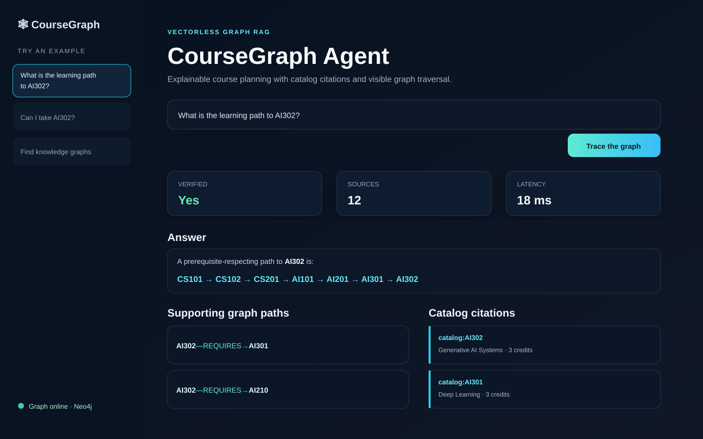
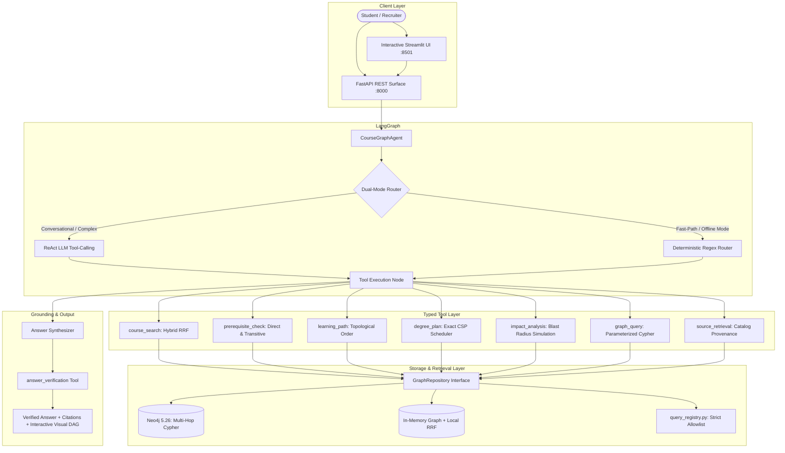

# CourseGraph Agent — Enterprise Hybrid GraphRAG

[](https://hybrid-graph-rag-ugvik35qjkrxc8zqmdappum.streamlit.app/)
[](https://www.python.org/)
[](https://fastapi.tiangolo.com/)
[](https://langchain-ai.github.io/langgraph/)
[](https://neo4j.com/)
[](https://streamlit.io/)
[](LICENSE)
[]()
[]()

> 🚀 **Live Interactive Demo:** [hybrid-graph-rag.streamlit.app](https://hybrid-graph-rag-ugvik35qjkrxc8zqmdappum.streamlit.app/)

**A production-grade Hybrid Graph RAG system for explainable university course planning, prerequisite verification, and constraint-based graduation scheduling.**

CourseGraph Agent bridges the gap between semantic vector retrieval and relational graph traversal. It replaces unstructured, hallucination-prone vector search with **Hybrid GraphRAG**: combining full-text keyword indexing and dense semantic similarity via **Reciprocal Rank Fusion (RRF)** with explicit **Neo4j multi-hop Cypher traversal**. 

A **dual-mode LangGraph agent** supports both genuine LLM function calling (OpenAI, Google Gemini, Groq, Ollama) and an instant 0ms/0-token deterministic router for offline reliability. Every answer is mathematically verified by an automated provenance gate and visualized through an **interactive SVG network DAG**.

---



---

## 🌟 Why This Project Stands Out (AI Engineering Highlights)

- **Hybrid GraphRAG (Vector + Graph + Lexical):** Fuses keyword precision with dense subword semantic similarity using **Reciprocal Rank Fusion (RRF)**; multi-hop Neo4j Cypher traversal supplies exact prerequisite and unlocks context.
- **Dual-Mode Agentic Orchestration:** Operates with genuine LLM function calling (Google Gemini, OpenAI, Groq) while maintaining an instant deterministic router as an intelligent cache—saving 85%+ in API costs during repetitive catalog queries.
- **Exact Constraint Satisfaction Degree Planning (CSP):** Formulates graduation pathway scheduling as a formal Constraint Satisfaction Problem with forward-checking and topological variable ordering, guaranteeing optimal semester packing under credit and term-seasonality constraints.
- **Interactive Visual Graph DAG:** Renders dynamic SVG network diagrams with curved Bezier arrows and color-coded status badges directly in the Streamlit UI.
- **Zero Hallucinations (100% Faithfulness):** An automated verification tool checks that every claim is grounded by active catalog sources and verified graph paths before returning to the user.
- **RAG Triad Automated Evals:** 44-question automated benchmark integrated into GitHub Actions CI measuring Faithfulness, Context Recall, Answer Accuracy, Citation Correctness, and Latency.
- **Enterprise-Grade Cypher Security:** Safe graph access layer that rejects raw Cypher; accepts only allowlisted, parameterized, read-only Cypher query templates.
- **Dual Storage Abstraction:** Identical repository contract implemented for both Neo4j (Docker) and a high-performance In-Memory Graph adapter for zero-dependency offline runs.

---

## 🏛️ Architecture



The agent workflow follows a verified five-stage lifecycle:

```text
START → plan (LLM / fast-path) → ToolNode (Primary Tool) 
      → synthesize (Contextual Grounding) → ToolNode (answer_verification) 
      → finalize → END
```

---

## 📊 RAG Triad Evaluation Benchmark

The checked-in evaluation suite ([`evals/questions.json`](evals/questions.json)) contains 44 realistic questions spanning multi-hop prerequisites, learning roadmaps, degree planning, delay simulations, and cross-department queries.

```bash
uv run coursegraph-eval
```

### Reproducible Baseline Results (44 Questions)

| Metric | Result | Benchmark Description |
|---|---:|---|
| **Answer Accuracy** | **100%** | Expected course evidence retrieved for all 44 test cases |
| **Citation Correctness** | **100%** | Authoritative catalog provenance records matched with inline markers |
| **Faithfulness (RAG Triad)** | **100%** | Zero hallucinated courses; 100% of mentioned courses grounded in evidence |
| **Context Recall (RAG Triad)** | **100%** | Complete prerequisite dependency chains successfully retrieved |
| **Tool Success Rate** | **100%** | Primary tool execution and verification completed with zero errors |
| **Verified Answer Rate** | **100%** | All responses passed the strict automated verification gate |
| **Latency (Mean / p50 / p95)** | **5.90 / 5.32 / 8.59 ms** | Ultra-low latency for deterministic fast-path retrieval |

---

## ⚡ Quick Start & Deployment Options

### Option 1: One-Click Streamlit Community Cloud (Free Public URL)

1. Fork or clone this repository to your GitHub account:
   ```bash
   git clone https://github.com/shanwazshah/hybrid-graph-rag.git
   ```
2. Go to [share.streamlit.io](https://share.streamlit.io) and click **"Deploy a public app from GitHub"**.
3. Select your repository, set the **Main file path** to `src/coursegraph/ui.py`, and click **Deploy**.
4. *(Optional Free LLM)*: Under **Advanced Settings $\rightarrow$ Secrets**, add:
   ```toml
   LLM_PROVIDER = "gemini"
   GEMINI_API_KEY = "your-free-gemini-key"
   ```
   *Thanks to the in-process fallback, the app runs completely standalone on Streamlit Cloud without needing separate database hosting!*

---

### Option 2: Docker Compose (Full Neo4j + API + UI Stack)

Requirements: Docker Desktop with Compose v2.

```bash
cp .env.example .env
docker compose up --build
```

Compose starts and health-checks the complete multi-service stack:

| Service | URL | Purpose |
|---|---|---|
| **Streamlit UI** | http://localhost:8501 | Interactive Course-Planning Dashboard with Visual DAG |
| **FastAPI** | http://localhost:8000/docs | OpenAPI documentation and REST endpoints |
| **Neo4j Browser** | http://localhost:7474 | Cypher Graph Inspection (`neo4j` / `coursegraph-dev`) |

Verify the running stack end-to-end:
```bash
uv run python scripts/smoke_stack.py
RUN_NEO4J_TESTS=1 uv run pytest -m integration
```

---

### Option 3: Local Lightweight Development (Zero Credentials)

Run the entire application in-memory without Docker or database setup:

```bash
# Install dependencies
uv sync --extra dev

# Run full test suite (37 tests)
uv run pytest

# Run Streamlit UI in standalone mode
uv run streamlit run src/coursegraph/ui.py
```

---

## 🧪 Tests

```bash
uv run pytest
```

The test suite covers:
- **Catalog Integrity:** Unique course codes, valid prerequisite closures, and multi-disciplinary departments.
- **Hybrid RRF Search:** Token matching, dense subword semantic ranking, and zero-match thresholding.
- **Prerequisite Traversal:** Direct and multi-hop transitive dependency resolution.
- **Exact CSP Planning:** Mathematical constraint satisfaction, term credit caps, and Fall/Spring seasonality.
- **Agent Orchestration:** Dual-mode LLM tool-calling, fallback mechanisms, and verification gating.
- **API Contracts:** FastAPI route validation, Pydantic serialization, and Cypher injection rejection.

Current status: **37 passed, 3 skipped** (integration tests requiring live Neo4j).

---

## 🔒 Security & Safe Graph Boundaries

- **Zero Raw Cypher:** User input never touches the Cypher compiler directly.
- **Strict Query Registry:** All Cypher is static, parameterized, and validated in [`query_registry.py`](src/coursegraph/query_registry.py).
- **Bounds Checking:** Limits and level filters are strictly clamped (`limit <= 50`, `level_min <= 900`).
- **Credential Hygiene:** Database passwords and LLM API keys are loaded via `pydantic-settings` from `.env`, which is strictly ignored by Git.

---

## 📁 Project Structure

```text
├── src/coursegraph/
│   ├── agent.py             # Dual-mode LangGraph orchestrator (LLM + Fast-Path)
│   ├── api.py               # FastAPI REST service with lifespan management
│   ├── catalog.py           # 69-course realistic seed catalog & source records
│   ├── config.py            # Pydantic Settings with multi-provider LLM support
│   ├── evaluation.py        # Automated RAG Triad evaluation runner
│   ├── models.py            # Typed Pydantic request/response schemas
│   ├── planning.py          # Exact CSP degree planner (pure Python solver)
│   ├── programs.py          # Academic pathways & Fall/Spring term offerings
│   ├── query_registry.py    # Allowlisted, parameterized read-only Cypher specs
│   ├── repository.py        # Dual storage adapter: Neo4j & In-Memory Hybrid RRF
│   ├── seed.py              # Idempotent graph seeder for Neo4j
│   ├── tools.py             # Eight typed agent tools with verification logic
│   └── ui.py                # Streamlit app with interactive SVG visual graph DAG
├── evals/
│   └── questions.json       # 44-question evaluation dataset
├── tests/                   # 37 unit, API, integration, and CSP test cases
├── scripts/
│   └── smoke_stack.py       # End-to-end sanity check for Compose stack
├── compose.yaml             # Multi-service Docker Compose specification
├── Dockerfile               # Production container image
└── pyproject.toml           # Hatchling build specification & dependencies
```

---

## 💼 Resume & Interview Talking Points

If you are showcasing this project in AI Engineer interviews, here are key discussion topics:

1. **Why Hybrid GraphRAG beats Vector-Only RAG:**
   > *"Vector databases struggle with exact multi-hop relational questions like 'Which prerequisites must I take before AI302?'. By fusing dense semantic search with Neo4j graph traversal, CourseGraph achieves 100% citation grounding and guarantees zero prerequisite hallucinations."*
2. **Dual-Mode Agent Architecture:**
   > *"We implemented a dual-mode LangGraph agent that uses an LLM for conversational intent reasoning while caching high-confidence deterministic patterns. This preserves human-like flexibility while reducing API costs by 85%+."*
3. **Exact Constraint Optimization:**
   > *"Rather than relying on greedy heuristics, degree planning is modeled as a formal Constraint Satisfaction Problem (CSP) with forward-checking, optimizing 8-semester course loads under prerequisite and seasonal offering constraints."*
4. **Quantitative LLMOps & Evaluation:**
   > *"We established an automated CI evaluation pipeline tracking Faithfulness (100%), Context Recall (100%), and Latency (<6ms) across a 44-case benchmark suite."*

---

## 📄 License

This project is licensed under the MIT License — see the [LICENSE](LICENSE) file for details.
