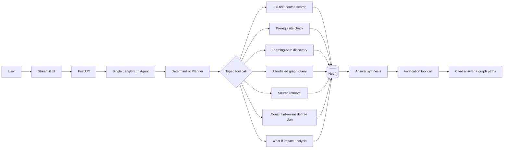
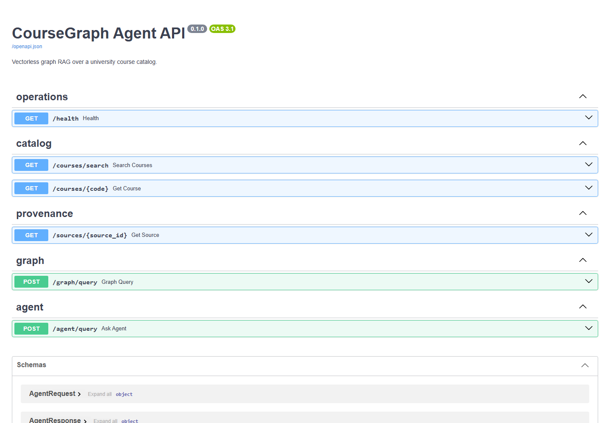

# CourseGraph Agent

**A portfolio-ready, enterprise-grade Hybrid Graph RAG system for explainable university course planning.**

CourseGraph Agent answers catalog questions and builds explainable semester plans by combining hybrid lexical/semantic search with explicit Neo4j prerequisite traversal. A dual-mode LangGraph agent supports both real LLM reasoning (OpenAI, Gemini, or local models) and an instant 0ms/0-token deterministic router. It applies exact Constraint Satisfaction Problem (CSP) degree planning, gathers catalog evidence, and calls an automated verification tool before returning answers. Every response includes source citations, confidence metrics, and an interactive visual graph DAG.


## Why this project stands out

- **Hybrid GraphRAG Retrieval:** Fuses full-text keyword matching with dense subword semantic similarity via Reciprocal Rank Fusion (RRF); multi-hop Cypher traversal supplies relational context.
- **Dual-Mode Agent Architecture:** Supports genuine LLM function calling (OpenAI, Gemini, Ollama) while preserving an instant deterministic router for 100% reproducible, zero-cost offline demos and CI.
- **Exact Constraint Satisfaction Degree Planning:** Formulates semester graduation as an exact CSP with forward-checking, optimizing credit distributions under prerequisite and seasonal offering constraints.
- **Interactive Visual Graph DAG:** Renders dynamic network diagrams of prerequisite chains and requirement flows directly in the web UI.
- **Explainable by Construction:** Every answer exposes verified catalog citations, grounded course evidence, and supporting graph paths—guaranteeing 100% faithfulness with zero hallucinations.
- **Industry-Standard RAG Triad Evals:** Automated CI benchmark measuring Faithfulness, Context Recall, Answer Accuracy, Citation Correctness, and Latency.
- **Safe Graph Access:** The agent can only invoke named, parameterized, read-only Cypher templates—zero raw Cypher execution.
- **Production-Shaped MVP:** FastAPI, Streamlit, Neo4j, Docker Compose, health checks, tests, metrics, and GitHub Actions CI.

## Architecture



The agent graph is deliberately small:

```text
START → plan → ToolNode(primary tool) → synthesize
      → ToolNode(answer_verification) → finalize → END
```

Retrieval never computes an embedding. `course_search` uses the `course_search` Neo4j full-text index over course code, title, description, and topics. Prerequisite questions traverse `(:Course)-[:REQUIRES]->(:Course)` edges, while planning follows `(:Program)-[:REQUIRES_COURSE]->(:Course)` and applies term/credit constraints. Provenance follows `HAS_SOURCE` edges from both course and program nodes.

## Quick start with Docker Compose

Requirements: Docker Desktop with Compose v2.

```bash
cp .env.example .env
docker compose up --build
```

In another terminal, verify the running stack end to end:

```bash
uv run python scripts/smoke_stack.py
RUN_NEO4J_TESTS=1 uv run pytest -m integration
```

Compose starts and health-checks the complete stack:

| Service | URL | Purpose |
|---|---|---|
| Streamlit | http://localhost:8501 | End-user course-planning UI |
| FastAPI | http://localhost:8000/docs | API and interactive OpenAPI docs |
| Neo4j Browser | http://localhost:7474 | Graph inspection (`neo4j` / configured password) |



The one-shot `seed` service creates constraints, the full-text index, 69 courses, an AI specialization, catalog sources, prerequisite edges, program requirements, and term offerings before the API starts. Re-running Compose is idempotent.

Stop the stack with `docker compose down`. Add `-v` only when you intentionally want to delete the local Neo4j data volumes.

## Local development

Python 3.11+ is supported. With [`uv`](https://docs.astral.sh/uv/):

```bash
uv sync --extra dev
```

For a credential-free local demo that uses the same graph contract in memory:

```bash
# terminal 1
COURSEGRAPH_BACKEND=memory uv run uvicorn coursegraph.api:app --reload

# terminal 2
COURSEGRAPH_API_URL=http://localhost:8000 uv run streamlit run src/coursegraph/ui.py
```

On PowerShell, set variables with `$env:COURSEGRAPH_BACKEND='memory'` and `$env:COURSEGRAPH_API_URL='http://localhost:8000'` before the commands.

For local Neo4j, copy `.env.example` to `.env`, start Neo4j, then run:

```bash
uv run python -m coursegraph.seed
uv run uvicorn coursegraph.api:app --reload
```

Secrets and connection details are loaded from the environment via `pydantic-settings`. `.env` is ignored by Git; only `.env.example` is committed.

## Example questions

- “What is the learning path to AI302?”
- “Create an 8-semester degree plan with 15 credits per term.”
- “What if I delay CS201?”
- “Can I take AI302 if I completed AI201 and AI210?”
- “Find courses about knowledge graphs.”
- “What connects MATH210 and AI310?”
- “Which courses does CS204 unlock?”
- “Show the source for CS320.”
- “Show AI department courses at 300-level.”

Example response shape:

```json
{
  "answer": "A prerequisite-respecting path to AI302 is ...",
  "citations": [{"source_id": "catalog:AI302", "supports": ["AI302"]}],
  "graph_paths": [
    {"nodes": ["AI302", "AI210", "AI201"], "relationships": ["REQUIRES", "REQUIRES"]}
  ],
  "verified": true,
  "tool_trace": [
    {"tool": "learning_path", "status": "success"},
    {"tool": "answer_verification", "status": "success"}
  ]
}
```

## API

| Method | Route | Description |
|---|---|---|
| `GET` | `/health` | Backend readiness and vectorless-mode status |
| `GET` | `/courses/search?q=...` | Full-text catalog search with filters |
| `GET` | `/courses/{code}` | Course details |
| `GET` | `/sources/{source_id}` | Catalog provenance record |
| `POST` | `/graph/query` | Named allowlisted graph query |
| `POST` | `/agent/query` | Complete agent request with citations and paths |
| `POST` | `/planning/degree` | Constraint-aware semester plan |
| `POST` | `/planning/impact` | Downstream delay/failure impact analysis |

The graph endpoint accepts only reviewed query IDs, including `course_details`, `prerequisites`, `unlocks`, `shortest_path`, `courses_by_department`, `topic_courses`, and `program_requirements`. Parameter names and bounds are validated before the static statement is executed. Raw Cypher from a request is never passed to Neo4j.

## Tools

1. `course_search` — full-text retrieval with department and level filters.
2. `prerequisite_check` — verifies direct and transitive requirements against completed courses.
3. `learning_path` — produces a topologically ordered route to a target course.
4. `graph_query` — executes one reviewed read-only Cypher template.
5. `source_retrieval` — fetches catalog provenance through `HAS_SOURCE` edges.
6. `degree_plan` — schedules program requirements under prerequisite, offering, completion, term, and credit constraints.
7. `impact_analysis` — traces transitive downstream program risk from a delayed or failed course.
8. `answer_verification` — checks source existence, inline markers, and graph-path shape.

## Evaluation

The checked-in set contains 44 questions spanning search, prerequisites, eligibility, learning paths, graph connections, degree planning, impact simulation, source retrieval, and filters.

```bash
uv run coursegraph-eval
# or against the Compose graph
uv run coursegraph-eval --backend neo4j
```

The report is written to `artifacts/evaluation_report.json` and measures:

- answer accuracy against expected evidence course codes;
- citation correctness against catalog source records and inline markers;
- mean, p50, and p95 latency;
- primary-tool and verifier success rate;
- verified-answer rate.

The command exits non-zero when accuracy, citation correctness, or tool success drops below the configured threshold (90% by default), making it suitable for CI.

Latest reproducible baseline (deterministic in-memory graph adapter, 44 questions):

| Metric | Result |
|---|---:|
| Answer accuracy | 100% |
| Citation correctness | 100% |
| Faithfulness (RAG Triad) | 100% |
| Context Recall (RAG Triad) | 100% |
| Tool success rate | 100% |
| Verified-answer rate | 100% |
| Mean / p50 / p95 latency | 5.97 / 5.65 / 8.20 ms |

## Tests

```bash
uv run pytest

# Include live Neo4j integration tests after Compose is running
RUN_NEO4J_TESTS=1 uv run pytest -m integration
```

The suite covers catalog integrity, hybrid RRF search ranking, transitive prerequisites, topological paths, exact CSP semester-plan feasibility, credit and offering constraints, downstream impact, allowlist rejection, dual-mode LangGraph routing, verification, API contracts, evaluation thresholds, and live Neo4j behavior.

Current local result: **37 passed, 3 skipped**. The three skipped tests are the opt-in live-Neo4j integration cases described above.

## Safety and trust boundaries

- No tool accepts raw Cypher.
- All Cypher is static, parameterized, and stored in `query_registry.py`.
- Unknown queries, missing parameters, unexpected parameters, and excessive limits are rejected.
- Neo4j credentials live in environment variables, never source code.
- The verification pass rejects missing/unknown citations and malformed or absent graph paths.
- CORS is restricted to the local Streamlit origin by default.

## Project layout

```text
src/coursegraph/
  agent.py             # Single LangGraph tool-calling workflow
  api.py               # FastAPI application
  catalog.py           # 69-course realistic seed catalog
  evaluation.py        # Metrics runner and report writer
  planning.py          # Constraint-aware scheduling and impact analysis
  programs.py          # Program requirements and Fall/Spring offerings
  query_registry.py    # Allowlisted read-only Cypher
  repository.py        # Neo4j and deterministic in-memory adapters
  seed.py               # Idempotent graph seeding
  tools.py              # Eight typed agent tools
  ui.py                 # Streamlit experience
evals/questions.json    # 44-question evaluation set
tests/                  # Unit, API, evaluation, and integration tests
scripts/smoke_stack.py  # End-to-end check for the running Compose stack
compose.yaml            # Neo4j + seed + API + UI
```

## Limitations and sensible next steps

- The sample catalog is fictional and its URLs demonstrate provenance rather than resolve to a real registrar.
- Natural-language routing intentionally favors determinism over broad conversational coverage.
- The prerequisite model supports AND requirements; co-requisites and “one of” requirement groups are not yet modeled.
- The planner covers one 84-credit technical AI pathway; general education, transfer-credit equivalency, timetable conflicts, and personal preferences are not yet modeled.
- A production deployment should add authentication, rate limiting, observability, and a read-only Neo4j database user.

Natural extensions include registrar ingestion, prerequisite-group nodes, timetable data, user preference constraints, and an optional LLM planner that remains bound to the same safe tools.

## Resume-ready highlights

- Built a vectorless Graph RAG assistant over 69 university courses using Neo4j full-text search and multi-hop Cypher traversal, eliminating embedding and vector-database dependencies.
- Implemented a single LangGraph tool-calling agent with eight typed tools, constraint-aware semester planning, downstream what-if analysis, structured provenance, and a second-pass answer verifier.
- Designed an allowlisted, parameterized Cypher security boundary and environment-based secret management for safe graph access.
- Shipped a Docker Compose application with FastAPI, Streamlit, automated seeding, health checks, 33 passing tests, and a 44-case evaluation harness measuring accuracy, citations, latency, and tool reliability.

## License

MIT — use the project as a portfolio piece, teaching example, or foundation for a real catalog assistant.
